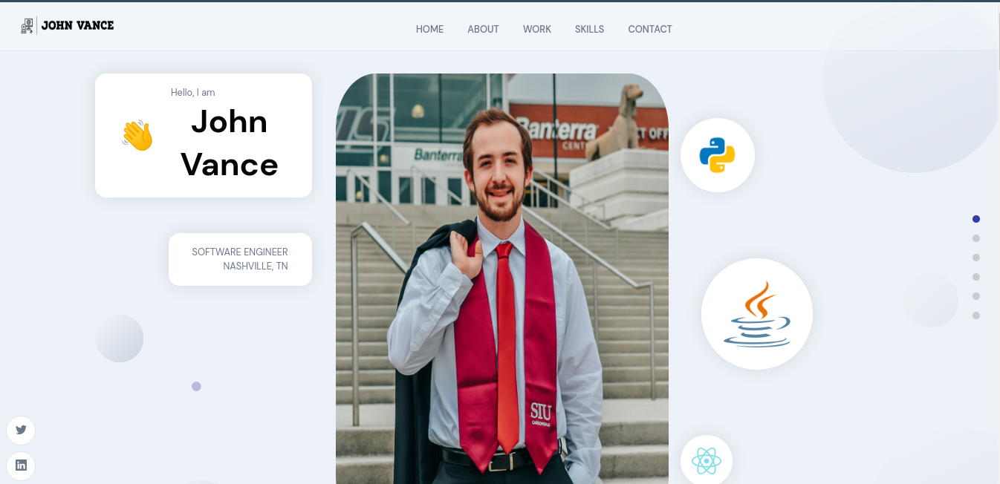
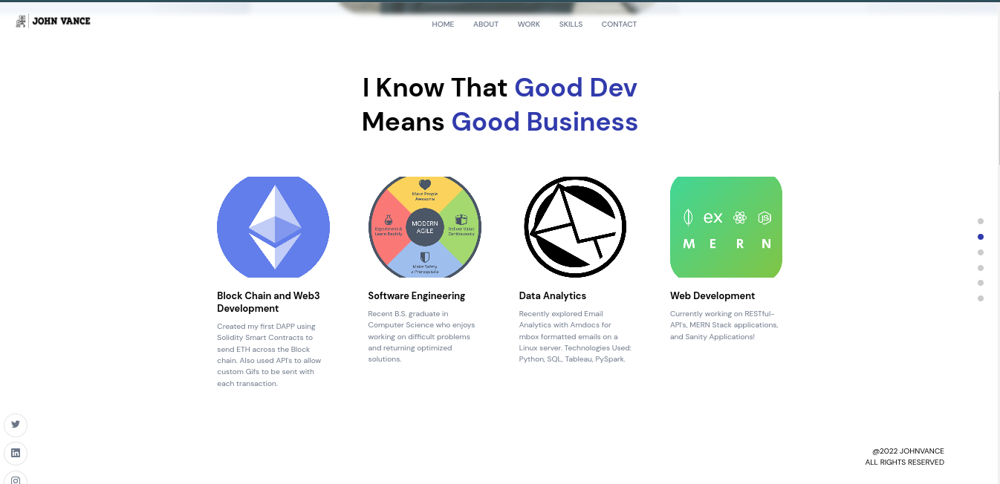

<!-- PROJECT LOGO -->
 

  <h1 align="center">Portfolio Showcase with Sanity and React</h1>

  
  <h2 align="center">
    Portfolio Showcase to display work accomplishments, testimonials, and contact information.
     
  </h2>
  

<!-- ABOUT THE PROJECT -->
## About The Project

- Built web application to serve as portfolio showcase of all work done to date. Utilized Sanity query API to allow for smooth CI/CD and updating of completed projects. 
- React on front-end to serve responsive, clean UX design. Includes bio, Creative Portfolio, Skills & Experiences, Testimonials, and contact form.
- With Sanity CMS I can update projects without having to refactor code or logic.

(<a href="#top">back to top</a>)

### Built With

Built with the following:

* [React](https://reactjs.org/)
* [Sanity](https://www.sanity.io/)
* [Node.js](https://nodejs.org/en/)
* [Sass](https://sass-lang.com/)

(<a href="#top">back to top</a>)

### Conclusion

Will update via Sanity, therefore no updates should be necessary.

(<a href="#top">back to top</a>)

